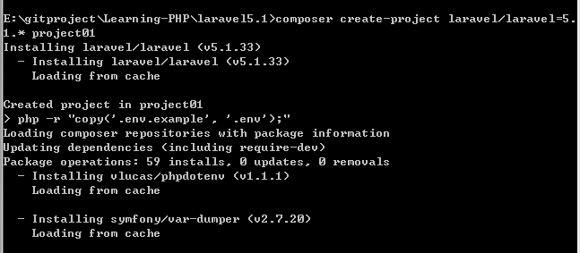
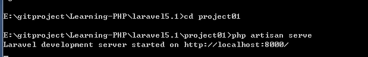
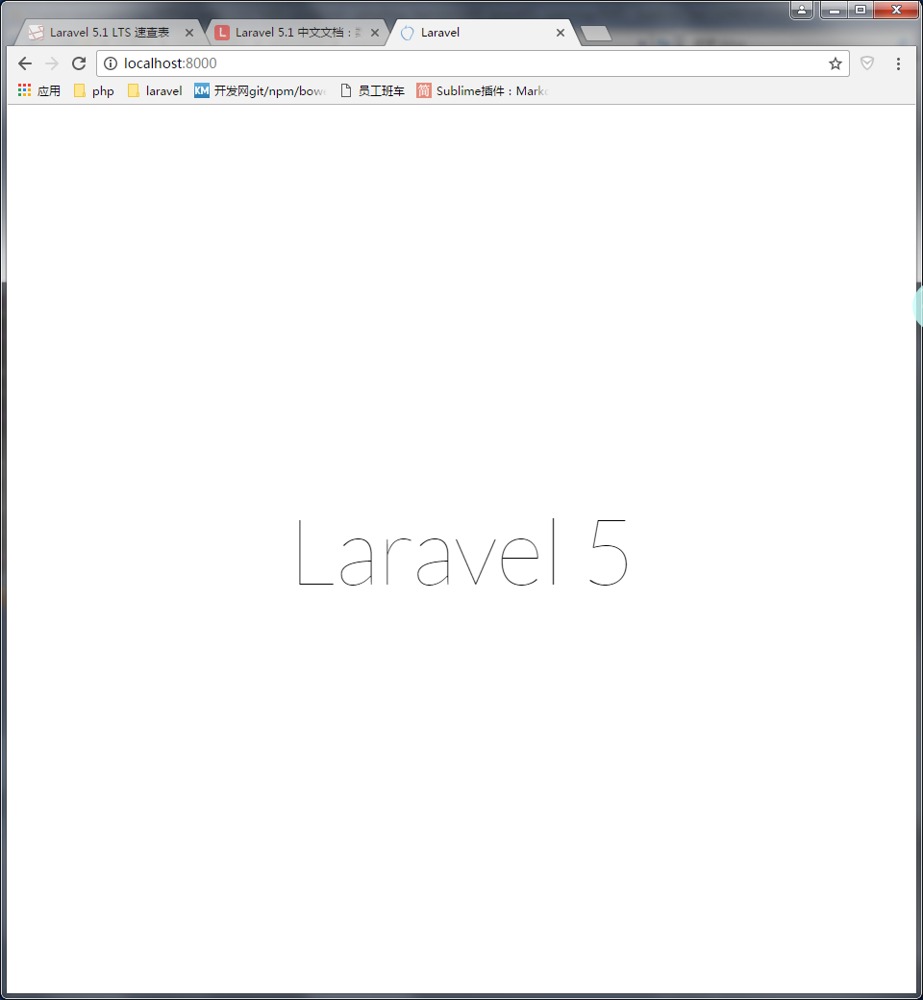
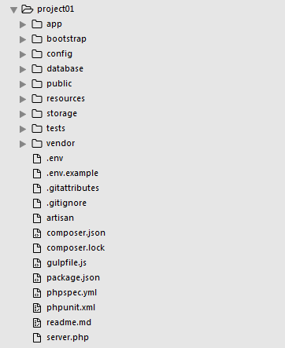
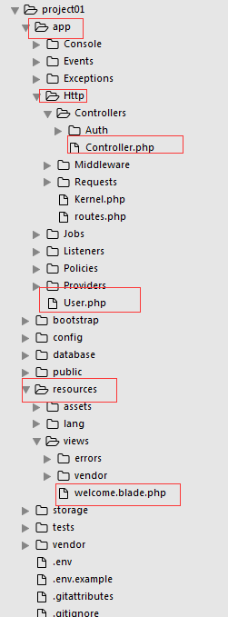

# 新建laravel项目

使用composer命令, 因为不同版本可能目录结构不一样，可以手动指定版本，如果不指定，将使用最新版本。

```php
composer create-project laravel/laravel=5.1.* project01
```

出现一大串的安装过程




停止后，进入blog目录，使用`php artisan serve`启动



最后使用`localhost:8000`访问即可



创建的项目在这个目录，文件夹名为project01

下面是它的目录结构



具体每个目录是干嘛的，可以自行百度。对开发而言，关键的目录有app目录(放置Controller代码和Model代码)，resources目录(放置View代码，也就是php)

