# 和数据库有关的artisan命令

laravel框架能够很方便的管理数据库，在创建表，模拟数据等方面都很出色。在学习这个框架是如何进行CRUD之前，首先需要知道学会前面说的功能。

这里新建了一个project02项目，注意当前目录是这个项目，此时的项目和project01相同。

### 第一个命令: `php artisan make:model model_name`

用于创建model类
比如这里使用 `php artisan make:model Article`

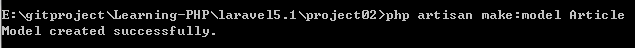

命令执行后，会在`/project02/app/` 目录下生成Article.php

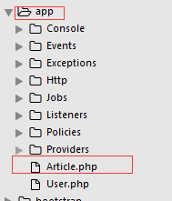

文件内容如下

```php
<?php

namespace App;

use Illuminate\Database\Eloquent\Model;

class Article extends Model
{
    //
}
```

### 第二个命令： `php artisan make:migration table_name` 

用于通过代码，以方便第三个命令生成数据库表

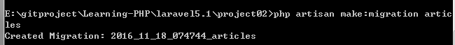

接着在/database/migrations/目录下看到了我们新建的php文件

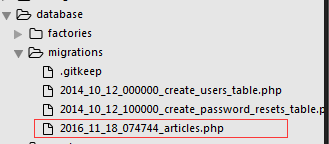

内容如下：

```php
<?php

use Illuminate\Database\Schema\Blueprint;
use Illuminate\Database\Migrations\Migration;

class Articles extends Migration
{
    /**
     * Run the migrations.
     *
     * @return void
     */
    public function up()
    {
       
    }

    /**
     * Reverse the migrations.
     *
     * @return void
     */
    public function down()
    {
        //
    }
}

```

up()函数在我们使用`php artisan migrate`命令时发挥作用，生成数据库表。**Laravel 默认 Model 对应的表名是这个英文单词的复数形式**

我们填入内容；


```php
<?php

use Illuminate\Database\Schema\Blueprint;
use Illuminate\Database\Migrations\Migration;

class Articles extends Migration
{
    /**
     * Run the migrations.
     *
     * @return void
     */
    public function up()
    {
        Schema::create('articles', function(Blueprint $table)
        {
            $table->increments('id');
            $table->string('title', 100);
            $table->text('content')->nullable();
            $table->integer('user_id');
            $table->timestamps();
        });
    }

    /**
     * Reverse the migrations.
     *
     * @return void
     */
    public function down()
    {
        //
    }
}
```

### 第三个命令： `php artisan migrate` 

用于生成数据库表

执行这个命令时可能报错，因为数据库连接问题。

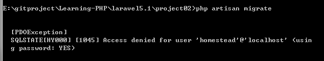

打开.env文件，修改成正确的参数，再次执行，可以看到数据库多了一张articles表，就是我们在Articles里面定义了之后生成的。

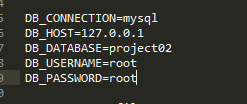

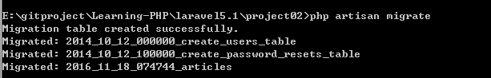

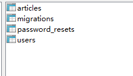

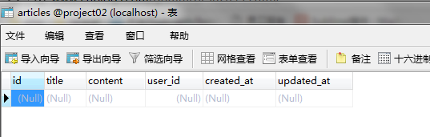

### 第四个命令： `php artisan make:seeder AritcileSeeder`

种子指的是方便我们向数据库插入数据，减去我们手动插入测试数据的麻烦。

```php
php artisan make:seeder ArticleSeeder
```

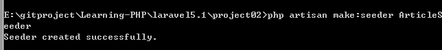

在/database/seeds/目录下看到了ArticleSeeder.php文件

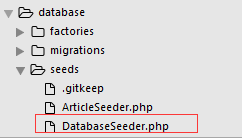

内容为

```php
<?php

use Illuminate\Database\Seeder;

class ArticleSeeder extends Seeder
{
    /**
     * Run the database seeds.
     *
     * @return void
     */
    public function run()
    {
        //
    }
}

```


将我们要插入的数据放到run方法中, 比如

```php
public function run()
{
    DB::table('articles')->delete();

    for ($i=0; $i < 10; $i++) {
        \App\Article::create([
            'title'   => 'Title '.$i,
            'content'    => 'Content '.$i,
            'user_id' => 1,
        ]);
    }
}
```

接着在DatabaseSeeder.php中注册

```
<?php

use Illuminate\Database\Seeder;
use Illuminate\Database\Eloquent\Model;

class DatabaseSeeder extends Seeder
{
    /**
     * Run the database seeds.
     *
     * @return void
     */
    public function run()
    {
        // $this->call(UserTableSeeder::class);
         $this->call(ArticleSeeder::class);
    }
}
```
执行下面的命令

### 第五个命令：`php artisan db:seed`

执行后发现报错了

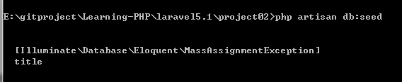

因为laravel为了防止恶意插入无用的数据，我们需要手动的配置哪些可以插入。修改Article.php，认为下面借个是可以插入的

```php
class Article extends Model
{
    protected $fillable = ['user_id', 'title', 'content'];
}
```

再次执行，查看数据库，发现已经插入了


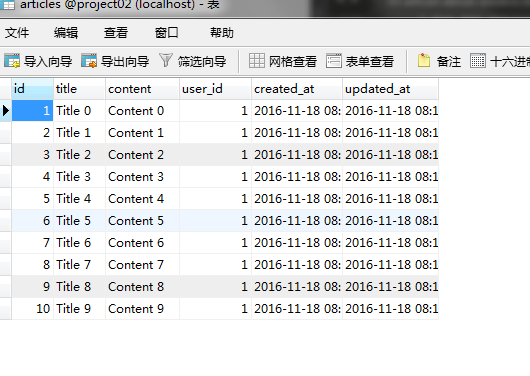

最后就可以进行数据库操作了.

附：数据库表我导出来放到了project02项目下，文件名为`project02.sql`