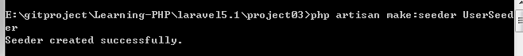
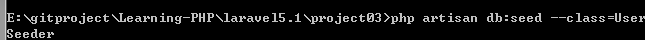
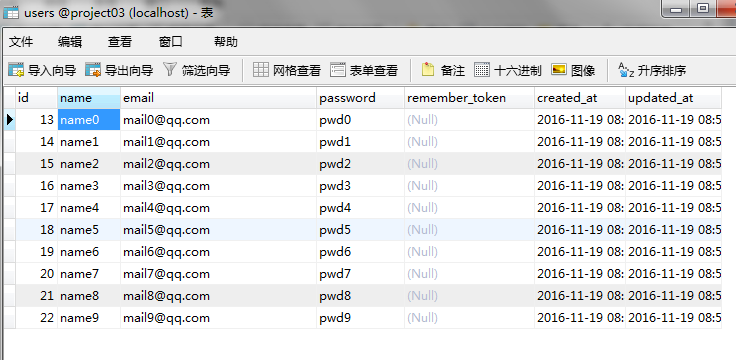
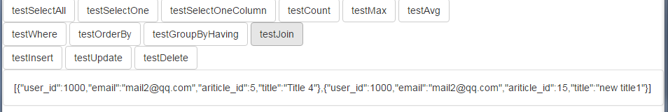

# 数据库操作

对应project03，测试数据库的CRUD

数据库和project02相比，主要是在users表中添加了数据用来测试join, 同时修改了原有的数据用来测试更多的语句。

使用了如下语句





UserSeeder文件也已经生成并配置完成放到在对应的目录下。

users表构造如下：



我将数据库导出放到project03目录下，但是是测试之后的结果，不是原数据。文件名为`project03.sql`，只需在本地创建这个数据库并导入就可以了。同时使用了jq和bootstrap, 已放到了public目录下。使用`php artisan serve`启动,将数据库返回的信息展示在前端。

结果如下图：



关键代码文件是下面几个,具体运行情况需要部署起来和数据库结合起来查看结构，可以自己构造数据，修改语句测试：

在/app/Http/Controllers/下创建EloquentController,里面`DB::table`相关的语句是关键。

```php
<?php

namespace App\Http\Controllers;

use App\User;
use App\Http\Controllers\Controller;
use DB;

class EloquentController extends Controller
{
 
// 方法一
// $data = ['code'=>200, 'msg'=>'add successful'];
// return json_encode ($data);

// 方法二
// $data = ['code'=>200, 'msg'=>'add successful'];
// return response()->json($data)
    public function insert()
    {

        DB::table('articles')->insert([
            ['title'=>'new title1','content'=>'new content1','user_id'=>1000],
            ['title'=>'new title2','content'=>'new content2','user_id'=>1001]
            ]);
        DB::table('articles')->insert(
            ['title'=>'new title3','content'=>'new content3','user_id'=>1003]
            );

        $id = DB::table('articles')->insertGetId(
            ['title'=>'new title4','content'=>'new content4','user_id'=>1004]
            );
        return json_encode (['id'=>$id]);
    }

    public function update()
    {
        DB::table('articles')->where('user_id', 2000)->update(['title'=>'update title']);
    }
    public function delete()
    {
        DB::table('articles')->where('id',"<",'3')->delete();
    }

    public function selectAll()
    {
        $articles = DB::table('articles')->get();
        return $articles;
    }

    public function selectOne()
    {
        $articles = DB::table('articles')->where('user_id', '2')->first();
        return json_encode ($articles);
    }

    public function selectOneColumn()
    {
        $titles = DB::table('articles')->where('user_id','2')->lists('title');
        return json_encode ($titles);
    }

    public function count()
    {
        $count = DB::table('articles')->where('user_id','2')->count();

        return json_encode($count);
    }

    public function max()
    {
        $max_id = DB::table('articles')->where('content','hello')->max('user_id');
         return json_encode($max_id); 
    }

    public function avg()
    {
        $avg_id = DB::table('articles')->where('content','hello')->avg('user_id');
         return json_encode($avg_id); 
    }

    public function where()
    {

        $users1 = DB::table('articles')->where('id','>','8')->get();//<>  >= <=

        $users2 = DB::table('articles')->where('content','like','new%')->get();

        // and 5.1没有数组形式的
        // $users3 = DB::table('articles')->where([
        //     ['id', '>', 17],
        //     ['user_id','=','1000'],
        //     ])->get();

        $users3 = DB::table('articles')->where('id', '>', 5)->where('user_id','1000')->get();

        //is null
        $users4 = DB::table('articles')->whereNull('content')->get();
        //or
        $users5 = DB::table('articles')->where('id','<=','4')->orWhere('user_id',1000)->get();
        // between a and b
        $users6 = DB::table('articles')->whereBetween('id',[8,15])->get();
        // not between a and b
        // $users7 = DB::table('articles')->whereNotBetween('id',[8,15])->get();
        // in
        $users8 = DB::table('articles')->whereIn('id', [8,9,10,11])->get();
        // not in
        // $users9 = DB::table('articles')->whereNotIn('id', [8,9,10,11])->get();

        // 5.1没有
        // compare date, month, day
        // whereDate('created_at', '2016-10-10')
        // whereMonth('created_at', '10')
        // whereDay('created_at', '10')
        // whereYear('created_at', '2016')
        // $users9 = DB::table('articles')
        //         ->whereDay('created_at', '11')
        //         ->get();


        // select * from articles where id >=5 and (user_id = 1000 or content like 'null%') 
        $users10 = DB::table('articles')
                  ->where('id','>=',5)
                  ->where(function ($query) {
                        $query->where('user_id', 1000)
                              ->orwhere('id', 'like', 'null%');
                    })
                 ->get();


        $res = [
            '>' => $users1,
            'like' => $users2,
            'and' => $users3,
            'is null' => $users4,
            'or' => $users5,
            'between' => $users6,
            'in' => $users8,
            'a and (b or c)' => $users10,
        ];

        return json_encode($res); 
    }

    public function orderBy(){
        $users = DB::table('articles')
                ->orderBy('user_id', 'desc')
                ->get();
        return json_encode($users);
    }

    public function groupByHaving()
    {
        $users = DB::table('articles')
                ->select(DB::raw('id, avg(id) as avg'))
                ->whereIn('id', [5,15,16,17,18,19])
                ->groupBy('user_id')
                // ->having('account_id', '>', 100)
                ->get();
        return json_encode($users);
    }

    public function join()
    {
        // 还有leftJoin, rightJoin
        // select `articles`.`user_id`, `users`.`email`, `articles as ariticle_id`.`id`, `articles`.`title` from `articles` inner join `users` on `articles`.`user_id` = `users`.`id`
        $users = DB::table('articles')
                 ->join('users', 'articles.user_id', '=', 'users.id')
                 ->select('articles.user_id','users.email','articles.id as ariticle_id','articles.title')
                 ->get();
        return json_encode($users);
    }
}
```


/app/Http/routes.php配置路由，路由因为不是本节的重点，因此只要知道是映射关系就好了。

```php
<?php
Route::get('/', function () {
    return view('testcrud');
});


Route::get('/testInsert', 'EloquentController@insert');
Route::get('/testUpdate', 'EloquentController@update');
Route::get('/testDelete', 'EloquentController@delete');
Route::get('/testSelectAll', 'EloquentController@selectAll');
Route::get('/testSelectOne', 'EloquentController@selectOne');
Route::get('/testSelectOneColumn', 'EloquentController@selectOneColumn');
Route::get('/testCount', 'EloquentController@count');
Route::get('/testMax', 'EloquentController@max');
Route::get('/testAvg', 'EloquentController@avg');
Route::get('/testWhere', 'EloquentController@where');
Route::get('/testOrderBy', 'EloquentController@orderBy');
Route::get('/testGroupByHaving', 'EloquentController@groupByHaving');
Route::get('/testJoin', 'EloquentController@join');

```


testcrud.blade.php，简单的click事件，发异步，填入数据，应该没什么问题。

```php
<!DOCTYPE html>
<html>
    <head>
        <title>Test CRUD</title>
        <script src="{{ URL::asset('plugin/jquery-3.1.1/jquery-3.1.1.min.js') }}"></script>
        <script src="{{ URL::asset('plugin/bootstrap-3.3.0/bootstrap.min.js') }}"></script>
        <link rel="stylesheet" href="{{ URL::asset('plugin/bootstrap-3.3.0/bootstrap.min.css') }}">

        <script type="text/javascript">
            
            $(function(){

               
                $("#testSelectAll").click(function(){

                    $.ajax({
                         url:'/testSelectAll',
                         dataType:'json',
                         success: function(data){
                           $('#content').text(JSON.stringify(data));
                                  
                         }
                    });
                });

                $("#testSelectOne").click(function(){

                    $.ajax({
                         url:'/testSelectOne',
                         dataType:'json',
                         success: function(data){
                           $('#content').text(JSON.stringify(data));
                                  
                         }
                    });
                });

                $("#testSelectOneColumn").click(function(){

                    $.ajax({
                         url:'/testSelectOneColumn',
                         dataType:'json',
                         success: function(data){
                           $('#content').text(JSON.stringify(data));
                                  
                         }
                    });
                });


                $("#testCount").click(function(){

                    $.ajax({
                         url:'/testCount',
                         dataType:'json',
                         success: function(data){
                           $('#content').text(JSON.stringify(data));
                                  
                         }
                    });
                });
                 $("#testMax").click(function(){

                    $.ajax({
                         url:'/testMax',
                         dataType:'json',
                         success: function(data){
                           $('#content').text(JSON.stringify(data));
                                  
                         }
                    });
                });

                $("#testAvg").click(function(){

                    $.ajax({
                         url:'/testAvg',
                         dataType:'json',
                         success: function(data){
                           $('#content').text(JSON.stringify(data));
                                  
                         }
                    });
                });

                
                $("#testWhere").click(function(){

                    $.ajax({
                         url:'/testWhere',
                         dataType:'json',
                         success: function(data){
                           $('#content').text(JSON.stringify(data));
                                  
                         }
                    });
                });
                $("#testOrderBy").click(function(){

                    $.ajax({
                         url:'/testOrderBy',
                         dataType:'json',
                         success: function(data){
                           $('#content').text(JSON.stringify(data));
                                  
                         }
                    });
                });

                $("#testGroupByHaving").click(function(){

                    $.ajax({
                         url:'/testGroupByHaving',
                         dataType:'json',
                         success: function(data){
                           $('#content').text(JSON.stringify(data));
                                  
                         }
                    });
                });
                $("#testJoin").click(function(){

                    $.ajax({
                         url:'/testJoin',
                         dataType:'json',
                         success: function(data){
                           $('#content').text(JSON.stringify(data));
                                  
                         }
                    });
                });


                $("#testInsert").click(function(){

                    $.ajax({
                         url:'/testInsert',
                         dataType:'json',
                         success: function(data){
                           $('#content').text(JSON.stringify(data));
                                  
                         }
                    });
                });

              $("#testUpdate").click(function(){

                    $.ajax({
                         url:'/testUpdate',
                         dataType:'json',
                         success: function(data){
                           $('#content').text(JSON.stringify(data));
                                  
                         }
                    });
                });

              $("#testDelete").click(function(){

                    $.ajax({
                         url:'/testDelete',
                         dataType:'json',
                         success: function(data){
                           $('#content').text(JSON.stringify(data));
                                  
                         }
                    });
                });


            });


             

        </script>


    </head>
    <body>


    <div class="btn-group"  >
      <button type="button" class="btn btn-default" id="testSelectAll">testSelectAll</button>
    </div>

    <div class="btn-group">
      <button type="button" class="btn btn-default" id="testSelectOne">testSelectOne</button>
    </div>
    <div class="btn-group">
      <button type="button" class="btn btn-default" id="testSelectOneColumn">testSelectOneColumn</button>
    </div>


     <div class="btn-group">
      <button type="button" class="btn btn-default" id="testCount">testCount</button>
    </div>

    <div class="btn-group">
      <button type="button" class="btn btn-default" id="testMax">testMax</button>
    </div>

    <div class="btn-group">
      <button type="button" class="btn btn-default" id="testAvg">testAvg</button>
    </div>


    <br>
    <div class="btn-group"  >
      <button type="button" class="btn btn-default" id="testWhere">testWhere</button>
    </div>
    <div class="btn-group"  >
      <button type="button" class="btn btn-default" id="testOrderBy">testOrderBy</button>
    </div>
    <div class="btn-group"  >
      <button type="button" class="btn btn-default" id="testGroupByHaving">testGroupByHaving</button>
    </div>
    <div class="btn-group"  >
      <button type="button" class="btn btn-default" id="testJoin">testJoin</button>
    </div>
    <br>


    <div class="btn-group">
      <button type="button" class="btn btn-default" id="testInsert">testInsert</button>
    </div>
    <div class="btn-group">
      <button type="button" class="btn btn-default" id="testUpdate">testUpdate</button>
    </div>

    <div class="btn-group">
      <button type="button" class="btn btn-default" id="testDelete">testDelete</button>
    </div>

    <div class="panel panel-default">
      <div class="panel-body" id="content">
      </div>
    </div>
</html>


```