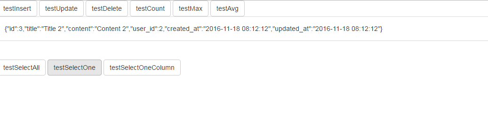

# Eloquent 数据库操作

对应project03，测试Eloquent的CRUD，数据库和project02的相同，只是数据改了，我将其导出放到project03目录下，文件名为`project03.sql`，只需在本地创建这个数据库并导入就可以了。同时使用了jq和bootstrap, 放到了public目录下。使用`php artisan serve`启动,将数据库返回的信息展示在前端。

结果如下图：



关键代码文件是下面几个,具体运行情况需要部署起来和数据库结合起来查看结构，可以自己构造数据，修改语句测试：

/app/Http/routes.php配置路由，路由因为不是本节的重点，因此只要知道是映射关系就好了。

```php

Route::get('/', function () {
    return view('testcrud');
});


Route::get('/testInsert', 'EloquentController@insert');
Route::get('/testUpdate', 'EloquentController@update');
Route::get('/testDelete', 'EloquentController@delete');
Route::get('/testSelectAll', 'EloquentController@selectAll');
Route::get('/testSelectOne', 'EloquentController@selectOne');
Route::get('/testSelectOneColumn', 'EloquentController@selectOneColumn');
Route::get('/testCount', 'EloquentController@count');
Route::get('/testMax', 'EloquentController@max');
Route::get('/testAvg', 'EloquentController@avg');
```

在/app/Http/Controllers/下创建EloquentController,在里面添加数据库相关语句

```php
<?php

namespace App\Http\Controllers;

use App\User;
use App\Http\Controllers\Controller;
use DB;

class EloquentController extends Controller
{
 
// 方法一
// $data = ['code'=>200, 'msg'=>'add successful'];
// return json_encode ($data);

// 方法二
// $data = ['code'=>200, 'msg'=>'add successful'];
// return response()->json($data)
    public function insert()
    {

        DB::table('articles')->insert([
            ['title'=>'new title1','content'=>'new content1','user_id'=>1000],
            ['title'=>'new title2','content'=>'new content2','user_id'=>1001]
            ]);
        DB::table('articles')->insert(
            ['title'=>'new title3','content'=>'new content3','user_id'=>1003]
            );

        $id = DB::table('articles')->insertGetId(
            ['title'=>'new title4','content'=>'new content4','user_id'=>1004]
            );
        return json_encode (['id'=>$id]);
    }

    public function update()
    {
        DB::table('articles')->where('user_id', 2000)->update(['title'=>'update title']);
    }
    public function delete()
    {
        DB::table('articles')->where('id',"<",'3')->delete();
    }

    public function selectAll()
    {
        $articles = DB::table('articles')->get();
        return $articles;
    }

    public function selectOne()
    {
        $articles = DB::table('articles')->where('user_id', '2')->first();
        return json_encode ($articles);
    }

    public function selectOneColumn()
    {
        $titles = DB::table('articles')->where('user_id','2')->lists('title');
        return json_encode ($titles);
    }

    public function count()
    {
        $count = DB::table('articles')->where('user_id','2')->count();

        return json_encode($count);
    }

    public function max()
    {
        $max_id = DB::table('articles')->where('content','hello')->max('user_id');
         return json_encode($max_id); 
    }

    public function avg()
    {
        $avg_id = DB::table('articles')->where('content','hello')->avg('user_id');
         return json_encode($avg_id); 
    }

}
```


testcrud.blade.php，简单的click事件，发异步，填入数据，应该没什么问题。

```php
<!DOCTYPE html>
<html>
    <head>
        <title>Test CRUD</title>
        <script src="{{ URL::asset('plugin/jquery-3.1.1/jquery-3.1.1.min.js') }}"></script>
        <script src="{{ URL::asset('plugin/bootstrap-3.3.0/bootstrap.min.js') }}"></script>
        <link rel="stylesheet" href="{{ URL::asset('plugin/bootstrap-3.3.0/bootstrap.min.css') }}">

        <script type="text/javascript">
            
            $(function(){

                $("#testInsert").click(function(){

                    $.ajax({
                         url:'/testInsert',
                         dataType:'json',
                         success: function(data){
                           $('#content').text(JSON.stringify(data));
                                  
                         }
                    });
                });

              $("#testUpdate").click(function(){

                    $.ajax({
                         url:'/testUpdate',
                         dataType:'json',
                         success: function(data){
                           $('#content').text(JSON.stringify(data));
                                  
                         }
                    });
                });

              $("#testDelete").click(function(){

                    $.ajax({
                         url:'/testDelete',
                         dataType:'json',
                         success: function(data){
                           $('#content').text(JSON.stringify(data));
                                  
                         }
                    });
                });
                $("#testSelectAll").click(function(){

                    $.ajax({
                         url:'/testSelectAll',
                         dataType:'json',
                         success: function(data){
                           $('#content').text(JSON.stringify(data));
                                  
                         }
                    });
                });

                $("#testSelectOne").click(function(){

                    $.ajax({
                         url:'/testSelectOne',
                         dataType:'json',
                         success: function(data){
                           $('#content').text(JSON.stringify(data));
                                  
                         }
                    });
                });

                $("#testSelectOneColumn").click(function(){

                    $.ajax({
                         url:'/testSelectOneColumn',
                         dataType:'json',
                         success: function(data){
                           $('#content').text(JSON.stringify(data));
                                  
                         }
                    });
                });


                $("#testCount").click(function(){

                    $.ajax({
                         url:'/testCount',
                         dataType:'json',
                         success: function(data){
                           $('#content').text(JSON.stringify(data));
                                  
                         }
                    });
                });
                 $("#testMax").click(function(){

                    $.ajax({
                         url:'/testMax',
                         dataType:'json',
                         success: function(data){
                           $('#content').text(JSON.stringify(data));
                                  
                         }
                    });
                });

                  $("#testAvg").click(function(){

                    $.ajax({
                         url:'/testAvg',
                         dataType:'json',
                         success: function(data){
                           $('#content').text(JSON.stringify(data));
                                  
                         }
                    });
                });

            });
        </script>


    </head>
    <body>

    <div class="btn-group">
      <button type="button" class="btn btn-default" id="testInsert">testInsert</button>
    </div>
    <div class="btn-group">
      <button type="button" class="btn btn-default" id="testUpdate">testUpdate</button>
    </div>

    <div class="btn-group">
      <button type="button" class="btn btn-default" id="testDelete">testDelete</button>
    </div>
     <div class="btn-group">
      <button type="button" class="btn btn-default" id="testCount">testCount</button>
    </div>

    <div class="btn-group">
      <button type="button" class="btn btn-default" id="testMax">testMax</button>
    </div>

    <div class="btn-group">
      <button type="button" class="btn btn-default" id="testAvg">testAvg</button>
    </div>

    <div class="panel panel-default">
      <div class="panel-body" id="content">
      </div>
    </div>

    <br>


    <div class="btn-group"  >
      <button type="button" class="btn btn-default" id="testSelectAll">testSelectAll</button>
    </div>

    <div class="btn-group">
      <button type="button" class="btn btn-default" id="testSelectOne">testSelectOne</button>
    </div>
    <div class="btn-group">
      <button type="button" class="btn btn-default" id="testSelectOneColumn">testSelectOneColumn</button>
    </div>
</html>

```