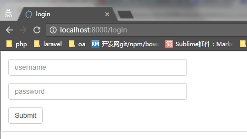
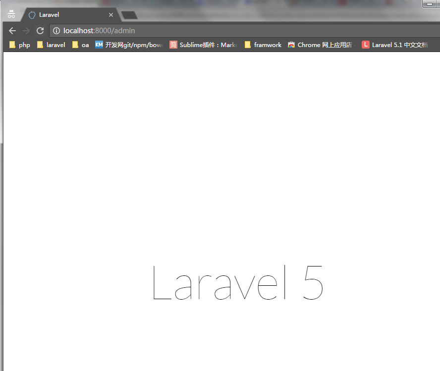

# 中间件

对应project05项目

这里我们以登录为例，当访问`localhost:8000/admin`时，如果未登录，则跳转了登录页面，如果已登录，则进入`/resources/views/admin/welcome.blade.php`，这个目录和文件是我自己创建的。

为了使登录好看一点，我加入了bootstrap，相关的框架放到了`/public/plugin`目录下，在这里说明一下，不影响功能展示。

下面是几个关键文件，包括Kernel.php(注册中间件)，LoginMiddleware.php(负责登录的拦截), routers.php(路由的选择，配置中间件)，LoginController.php(登录验证), login.blade.php(登录页面),welcome.blade.php(admin主页)

### 页面展示

当第一次访问`http://localhost:8000/admin`，尝试访问admin的主页时，将被中间件拦截验证session，由于没有记录，跳转到`http://localhost:8000/login`，进入登录页面(图1)。输入用户名密码后提交，如果验证正确，前端将其重定向到`http://localhost:8000/admin`，此时也被拦截，但是已经登录，访问admin主页成功，也就是图二。由此完成了登录的验证，如果验证失败，还是重定向图1，让其重新登录.






### Kernel.php

自己定义的中间件要放到/app/Http/Controllers/Middleware目录下。我新建了一个LoginMiddeware的文件。这里通过session判断是否已经登录。这个中间件要注册在/app/Http/Kenel.php文件中,其中middleware是全局中间件，所有代码都要经过的。我们的登录不用，可以放到routeMiddleware变量中，在需要的时候在routes.php文件中设置middleware参数以在特定的URL中使用这个中间间，可以在下面展示的routes.php中看到。同时把全局中间件的csrf的类注释掉，防止在点击登录时提示没有加入csrf token的问题。


```php
<?php

namespace App\Http;

use Illuminate\Foundation\Http\Kernel as HttpKernel;

class Kernel extends HttpKernel
{
    /**
     * The application's global HTTP middleware stack.
     *
     * @var array
     */
    protected $middleware = [
        \Illuminate\Foundation\Http\Middleware\CheckForMaintenanceMode::class,
        \App\Http\Middleware\EncryptCookies::class,
        \Illuminate\Cookie\Middleware\AddQueuedCookiesToResponse::class,
        \Illuminate\Session\Middleware\StartSession::class,
        \Illuminate\View\Middleware\ShareErrorsFromSession::class,
//下面这句是关键
        // \App\Http\Middleware\VerifyCsrfToken::class,
    ];

    /**
     * The application's route middleware.
     *
     * @var array
     */
    protected $routeMiddleware = [
        'auth' => \App\Http\Middleware\Authenticate::class,
        'auth.basic' => \Illuminate\Auth\Middleware\AuthenticateWithBasicAuth::class,
        'guest' => \App\Http\Middleware\RedirectIfAuthenticated::class,
//下面这句是关键
        'login' => \App\Http\Middleware\LoginMiddleware::class,
    ];
}
```


### LoginMiddleware


`LoginMiddleware.php`首先判断session中是否有admin这个key,如果有，则返回原来的处理链，对应代码的`return $next($request);`, 也就是返回到`Route::get('/'...`部分。否则则别拦截，进入`return redirect()->route('login');`，从`routes.php`中可以看到是跳转到`view('login')`，从哪里看出来的呢？因为`route('login')`的login映射到`routes.php`中的as别名，而不是看url（切记）,此时访问`login.blade.php`页面，输入用户名密码，将以post形式发送过来，从`routes.php`中看到将访问`LoginController`的login方法，LoginController中只是进行简单的判断，如果登录成功，则将admin作为key放入session中，接着返回200状态吗，从前端重定向到`/admin`中，否则还是跳转到登录页面。

```php
<?php

namespace App\Http\Middleware;

use Closure;

class LoginMiddleware
{
    public function handle($request, Closure $next)
    {
    	if(!$request->session()->has('admin')){
    		return redirect()->route('login');
    	}else{
    		return $next($request);
    	}
    }

}
```


## routes.php

当访问`/admin`时，会被别名为`login`的中间件拦截，这个别名就是routeMiddleware变量的key值,具体的在上面已经解释了。


```
<?php

// 添加中间件, 这里是登录中间件
Route::group(['middleware'=>'login', 'prefix'=>'admin'],function(){

	Route::get('/', function () {
        return view('admin.welcome');
    });
});


Route::get('/login', ['as' => 'login', function(){
	return view('login');
}]);

Route::post('/login', 'LoginController@login');

```


### LoginController.php

LoginController.php对用户名密码进行简单的判断，返回状态码，200代表登录成功，500代码登录失败


```php
<?php

namespace App\Http\Controllers;

use Illuminate\Http\Request;
use Illuminate\Http\Response;
use App\Http\Controllers\Controller;

class LoginController extends Controller
{
  
    public function login(Request $request)
    {
        
        $username = $_POST['username'];
        $password = $_POST['password'];

        if(trim($username) == 'admin' 
            && trim($password) == 'admin'){
            $code=200;
            $request->session()->put('admin', $username);
            return response()->json(['code'=>$code]);
        }else{
            $code=500;
            return response()->json(['code'=>$code]);
        }
    }
}

```

### login.blade.php

登录主要代码是异步的js,根据后台返回的200还是500决定如何跳转。

```html
<!DOCTYPE html>
<html>
    <head>
        <title>login</title>
        <script src="{{ URL::asset('plugin/jquery-3.1.1/jquery-3.1.1.min.js') }}"></script>
        <script src="{{ URL::asset('plugin/bootstrap-3.3.0/bootstrap.min.js') }}"></script>
        <link rel="stylesheet" href="{{ URL::asset('plugin/bootstrap-3.3.0/bootstrap.min.css') }}">

        <script type="text/javascript">
            
            $(function(){
                $("#loginButton").click(function(){

                    $.ajax({
                         url:'/login',
                         type:'post',
                         data:{
                            username:$('#username').val(),
                            password:$('#password').val()
                         },
                         success: function(data){
                            console.log(data);
                            if(data.code==200){
                                window.location.href="/admin";
                            }else{
                                window.location.href="/login";
                            }
                           
                                  
                         }
                    });
                });

            });


        </script>


    </head>
    <body>
        <div class="panel panel-default">
            <div class="panel-body">
                <form class="form-horizontal">
                <div class="form-group">
                  <!--   <label for="firstname" class="col-sm-2 control-label">名字</label> -->
                    <div class="col-sm-5">
                        <input type="text" class="form-control" placeholder="username" id="username">
                    </div>
                </div>
                <div class="form-group">
                    <div class="col-sm-5">
                        <input type="password" class="form-control" placeholder="password" id="password">
                    </div>
                </div>
                <input type='button' class="btn btn-default" id="loginButton" value='Submit'>
              </form>
            </div>

             </div>
        </div>

    </body>
</html>
```