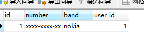
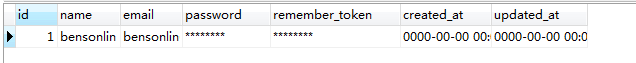
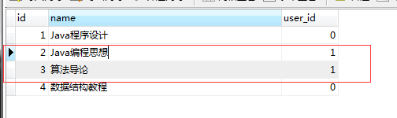
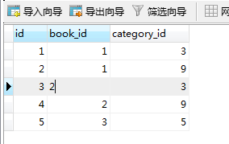

# Eloquent

对应project06，相关表导出到了项目根目录

### 准备工作：创建表

book表存放所有书，categories存放所有分类，book_category存放每本书的分类情况，users是用户的信息。

假设每种书只有一本，一旦被借出去就没了，如果借出去则记录user_id，否则设置为0，即users对book是一对多的。每本书有多个分类，放在category表中，一个分类可以对应多本书，也就是book和book_category是多对多，用来展示多对多。同时假设每个同学只有一个手机，而一个手机(phone表)也只属于一个用户，用来演示一对一。

```php
php artisan make:model Category -m
```

在app/目录下生成Category.php，-m相当于我们接下来使用了`php artisan make:migration`，只是帮我们顺便执行了，在/database/，因为实际项目中一般不会使用`php artisan migrate`去自动生成表，是先创建数据库，再用`make:model`创建model类，然后在这个类写上映射的table名($table变量)，所以实际上不需要加上-m参数。创建book并和表关联的例子如下。

使用`php artisan make:model Book`之后，查看这个model，一开始是这样的

```php
<?php

namespace App;

use Illuminate\Database\Eloquent\Model;

class Book extends Model
{
    //
}

```

在里面加上 `$table='book'`，也就是这个model将与book表关联起来，CRUD都是作用到这个表。

```php
<?php

namespace App;

use Illuminate\Database\Eloquent\Model;

class Book extends Model
{
	protected $table='book';
	public $timestamps = false;
}

```

同样的可以创建book_category对应的类，可以自己创建,只是修改了$table的值。User是使用原来创建项目时就产生的类，不用重新`make:model`。


### 一对一

一个用户只有一部手机(bensonlin用户拥有一部nokia手机),





为了获取用户的手机，可以在User中添加添加phone方法。一对一使用hasOne。**注意：除了hasOne之外，还有下面的hasMany，这些函数的应该在没有外键的类中调用，这样才能知道每个参数的意义**。

第一个参数是关联表，第二个参数是外键，第三个参数是主键，而不管是用hasOne，还是hasMany，还是belongsTo，**这个很重要**。


```php
public function phone()
{
    return $this->hasOne('\App\phone','user_id', 'id');
}
```


接着用`php artisan make:seeder BookSeeder`创建一个`BookSeeder`进行演示，seeder不懂的请看前面的文章。

```php
<?php

use Illuminate\Database\Seeder;
use App\Book;

class BookSeeder extends Seeder
{
    public function run()
    {
        $this->getBorrowUser();
    }

    // 一对一
    public function getPhone()
    {
    	$phone = User::find(1)->phone;
    	echo $phone;
    }

}

```


使用命令`php artisan db:seed --class=BookSeeder`，可以在控制台看到手机的信息拿出来了: 

```json
{"id":1,"number":"xxxx-xxxx-xxxx","band":"nokia","user_id":1}
```

#### 一对一反面：belongsTo

前面知道了如何获取用户拥有的手机，如果要反过来通过手机id，查看这个手机的用户，可以在Phone中添加phoneUser函数。下面belongsTo中的第二个参数依然是user_id，因为填的是外键。

```php
class Phone extends Model
{
    // 可以自定义表名
    protected $table = 'phone';

    // 不希望让 Eloquent 来自动维护这两个字段
    public $timestamps = false;

    protected $connection = 'mysql';

    public function phoneUser()
    {
    	return $this->belongsTo('\App\User','user_id','id');
    }
}
```


```json
{"id":1,"name":"bensonlin","email":"bensonlin@qq.com","phone_id":null,"created_a
t":"-0001-11-30 00:00:00","updated_at":"-0001-11-30 00:00:00"}
```

### 一对多

一个用户对应多本书，查看book表，可以看到bensonlin用户借了id为2和3两本书。



同样的，在User中新建一个函数,一对多使用hasMany,第一个参数是要关联类，第二个参数是外键(一般是外键， 也就是book表的user_id)，第三个是主键

```php
   public function borrowBooks()
    {
        //$this->hasMany('App\Comment', 'foreign_key', 'local_key');
        return $this->hasMany('App\Book', 'user_id', 'id');
    }
```

在Seeder中添加测试函数，并在run方法中调用
```php
// 一对多
public function getBorrowBooks()
{
	$books = User::find(1)->borrowBooks;
	echo $books;
}
```

执行`php artisan db:seed --class=BookSeeder`，结果就是这个用户借的两本书。

```json
[{"id":2,"name":"Java\u7f16\u7a0b\u601d\u60f3","user_id":1},{"id":3,"name":"\u7b
97\u6cd5\u5bfc\u8bba","user_id":1}]
```

#### 一对多反面: belongsTo

为了得到书是谁借的，可以在Book表中添加borrowUser函数。再次强调：hasOne和hasMany作用的函数都应该位于主键的表中，而belongsTo则应该位于外键的表中。


```php
//查出这本书谁借了
public function borrowUser()
{
	return $this->belongsTo('App\User','user_id','id');
}
```

结果仍然是

```json
{"id":1,"name":"bensonlin","email":"bensonlin@qq.com","created_at":"-0001-11-30 00:00:00","updated_at":"-0001-11-30 00:00:00"}
```


### 多对多

对多对多而言，不用新建中间表对应的Model，比如一本书对应多个分类，一个分类可以有多本书，如果要知道id=1的书有哪些分类，可以直接在Book中定义函数。



多对多使用belongsToMany函数，第一个参数是除了原表和中间表外的第三张表(不知道怎么描述)，第二个参数是中间表名称，第三个参数是中间表中原表主键id映射的键，第四个参数是第三张表中主键id映射的键。

```php
public function bookCategories()
{
	// return $this->belongsToMany('App\Role', 'user_roles', 'user_id', 'role_id');
	return $this->belongsToMany('App\Category','book_category','book_id','category_id');
}
```

BookSeeder中添加函数并执行

```php
//多对多
// 多对多
public function getBookCategories()
{
	$categories = Book::find(2);
	// echo $categories->bookCategories;
	//[{"id":3,"name":"Java","created_at":"2016-11-21 02:57:04","updated_at":"2016-11-21 02:57:04","pivot":{"book_id":2,"category_id":3}},{"id":9,"name":"\u7f16\u7a0b\u76f8\u5173","created_at":"0000-00-00 00:00:00","updated_at":"0000-00-00 00:00:00","pivot":{"book_id":2,"category_id":9}}]
	foreach ($categories->bookCategories as $category) {
		 echo $category->pivot;
	}
	//{"book_id":2,"category_id":3}{"book_id":2,"category_id":9}

}
```

结果(每次循环都分别打印出一个一对花括号)：

```json
{"book_id":2,"category_id":3}{"book_id":2,"category_id":9}
```

可以看出，如果需要拿出具体的分类，还需要在`Category::find(category_id)`才可以实现

如果需要拿出中间表的其他字段，可以加上withPivot，比如我们还要中间表的id。

```php
return $this->belongsToMany('App\Category','book_category','book_id','category_id')
			->withPivot('id');
//{"book_id":2,"category_id":3,"id":3}{"book_id":2,"category_id":9,"id":4}
```

### 进一步的筛选

不管是一对一，一对多(多对多似乎没有这种用法)，都可以对结果集进行再次筛选。

这里我们举个不是很符合实际但是能说明问题的例子。在一对多的例子中，结果为: 

```json
[{"id":2,"name":"Java\u7f16\u7a0b\u601d\u60f3","user_id":1},{"id":3,"name":"\u7b
97\u6cd5\u5bfc\u8bba","user_id":1}]
```

现在只要书id是3的书(现实是没有意义的)

```php
// 一对多再筛选
public function getBorrowBooksThenWhere()
{
	$books = User::find(1)->borrowBooks()->where('id',3)->get();
	echo $books;
}
```

结果只剩下一个`[{"id":3,"name":"\u7b97\u6cd5\u5bfc\u8bba","user_id":1}]`


### 最后一点点

最后这部分是使用eloquent的model替换前面使用`DB::table('xxx')`形式，逻辑很简单，这里简单贴上代码。

```php
<?php

use Illuminate\Database\Seeder;
use App\Category;

class CategorySeeder extends Seeder
{
    /**
     * Run the database seeds.
     *
     * @return void
     */
    public function run()
    {
        // DB::table('categories')->delete();
       
        $this->all();
    }

    public function update1()
    {
        $category = Category::find(3);
        $category->name = 'New Name';
        $category->save();
    }

    public function update2()
    {
        $category = Category::where('name','like','c%')
                ->where('id','>','5')
                ->update(['name'=>'c8888']);
    }
    public function insert1()
    {
        $category = new Category;
        $category->name='c3';
        $category->created_at = date('Y-m-d H:i:s',time());
        $category->updated_at = date('Y-m-d H:i:s',time());
        $category->save();
    }   
    public function insert2()
    {
        $now = date('Y-m-d H:i:s',time());
        Category::create(['name'=>'v9','created_at'=>$now, 'updated_at'=>$now]);
    }   

    public function delete1()
    {
        $category = Category::find(9);
        $category->delete();
    }


    public function delete2()
    {
        Category::destroy([10,11]);
        // Category::destroy(10,11);
        Category::destroy(10);
    }

    public function delete3()
    {
        Category::where('name','9999')->delete();
    }

    public function all()
    {
        $categories = Category::all();

        // foreach ($categories as $key => $value) {
             // echo $key;//0 1 2 3 4...下标
             // echo $value;//真正的keyvalue
             //{"id":3,"name":"New Name","created_at":"2016-11-21 02:57:04","updated_at":"2016-11-21 02:57:04"}{"id":4,"name":"c3","created_at":"2016-11-21 02:58:04","updated_at":"2016-11-21 02:58:04"}....
             // echo $value->name;
        // }
        foreach ($categories as $category) {//$category=$value，not $key
             echo $category->name;
        }

       
    }
}

```