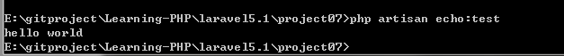
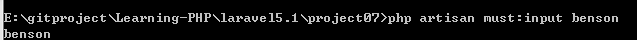

# 创建artisan命令

通过本教程，可以学会使用`php artisan xxx`执行命令运行想运行的代码。对应project07

command相关的代码放在`/app/Console/Commands`下，通过`php artisan make:console xxx`

这里创建了一个名叫EchoCommand的文件，简单的echo一下，执行命令后，可以在`/app/Console/Commands`下看到新建的文件。文件里面包含一个类，有两个字段，其中$signature是命令名，而$description是命令的描述。

```php
<?php

namespace App\Console\Commands;

use Illuminate\Console\Command;

class EchoCommand extends Command
{
    /**
     * The name and signature of the console command.
     *
     * @var string
     */
    protected $signature = 'echo:test';

    /**
     * The console command description.
     *
     * @var string
     */
    protected $description = 'test echo!!!';

    /**
     * Create a new command instance.
     *
     * @return void
     */
    public function __construct()
    {
        parent::__construct();
    }

    /**
     * Execute the console command.
     *
     * @return mixed
     */
    public function handle()
    {
        echo 'hello world';
    }
}

```

接着还要在Kernel.php中添加这个类到$commands变量中。在部署之后就可以执行`php artisan echo:test`

```php
    protected $commands = [
        Commands\Inspire::class,
        Commands\EchoCommand::class,
    ];
```




## 为命令添加参数

创建了一个MustInputComannd演示添加**必填参数**，其中`protected $signature = 'must:input {username}'`：

如果是**可选参数**可以添加?`must:input {username?}`或者添加默认值`must:input {username=bensonlin}`

使用`$this->argument('username');`获取输入的名字。

```php
<?php

namespace App\Console\Commands;

use Illuminate\Console\Command;

class MustInputCommand extends Command
{

    protected $signature = 'must:input {username}';

    protected $description = 'You must input arguement~~~';

    public function __construct()
    {
        parent::__construct();
    }

    public function handle()
    {
        $username = $this->argument('username');
        echo $username;
    }
}

```

执行命令：





`$arguments = $this->argument();`获取参数数组。

还有option方法，和argument很像，只是在没有的时候返回null。对应的，有`$options = $this->option();`获取所有参数。


## 让用户选择和确认

ask将显示在控制台上，而secret不会；confirm用来做选择，anticipate可以为可能的选择提供自动完成。用户仍可以选择任何答案而不理会这些选择；choice 让用户从给定选项里选择，用户会选择答案的索引，但是返回的是答案的值。可以设置返回默认值来防止没有任何东西被选择的情况：


$bar = $this->output->createProgressBar(count($topics));

$bar->advance();

$bar->finish();