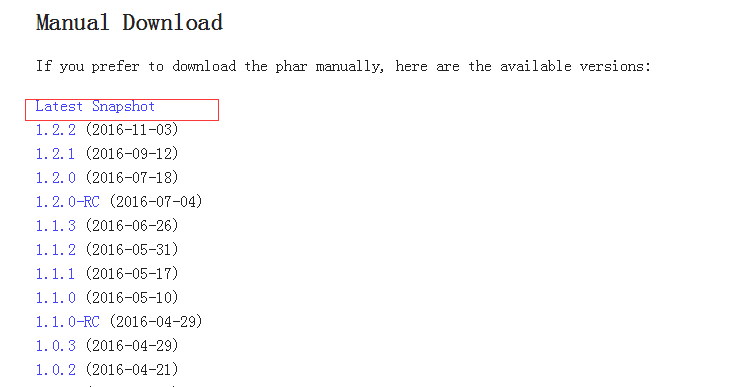
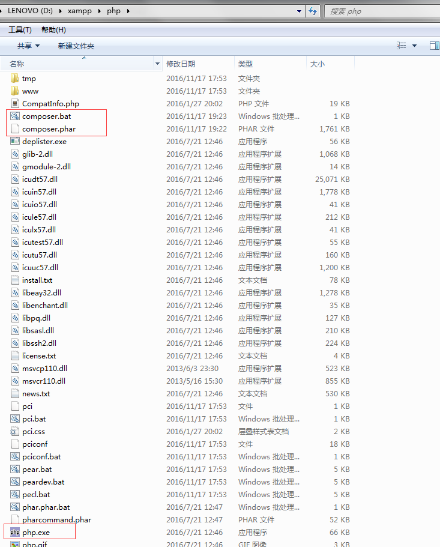
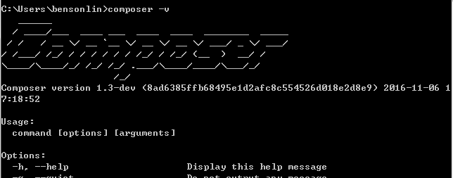

# composer安装

laravel框架需要依赖composer

进入[composer官网](https://getcomposer.org/download/)，下载 Latest Snapshot.



文件名为composer.phar，将其复制到php的安装目录下(也就是php所在目录)



接着在这个目录下新建文件composer.bat，写入

```bat
@ECHO OFF
php "%~dp0composer.phar" %*
```

如果还没设置php环境变量的先设置。让控制台能够使用php命令

最后打开新的cmd。输入composer -v提示成功



